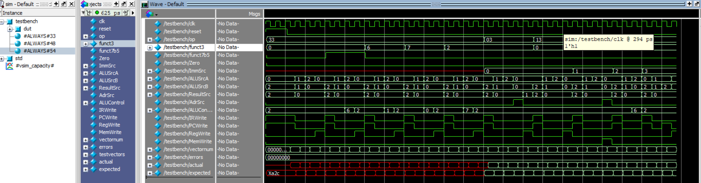

# ELE432 - HW2 + Preliminary Work 3  
## Multicycle RISC-V Controller & Processor

---

## 🎯 Objective

This work includes both:

- **HW2:** Design of a multicycle RISC-V controller  
- **Preliminary Work 3:** Integration of the controller with datapath and memory to build a complete multicycle RISC-V processor

---

## 🧠 Design Overview

### 🔹 Controller (HW2)

FSM-based controller including:
- Main FSM
- ALU Decoder
- Instruction Decoder

---

### 🔹 Multicycle Processor (Pre3)

Components:
- Controller
- Datapath
- Unified Memory

---

## 🧪 Simulation Results

### 🔹 Controller (HW2)

Controller testbench waveform:

Controller passes all tests with **0 error**:

---

### 🔹 Multicycle Processor (Pre3)

Final successful execution:

- `MemWrite = 1`
- `DataAdr = 0x00000064`
- `WriteData = 0x00000019`
mem[100] = 25

Waveform:

---

## 📈 Observations

- FSM transitions are correct
- ALU operations are correct
- Memory write confirms correct execution

---

## 🛠️ Tools

- SystemVerilog
- QuestaSim / ModelSim
- Quartus

---

## ⏱️ Time

- HW2: ~1 hour  
- Pre3: ~7–8 hours  

---
