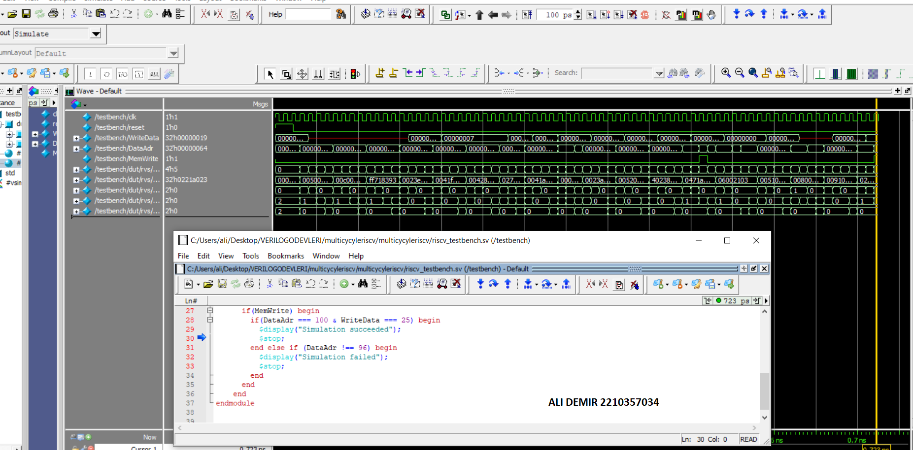
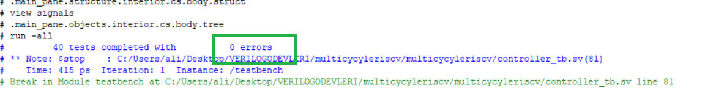

# ELE432 - HW2 + Preliminary Work 3  
## Multicycle RISC-V Processor & Controller

---

## 🎯 Objective

This work includes both:

- **HW2:** Design of a multicycle RISC-V controller  
- **Preliminary Work 3:** Integration of the controller with datapath and memory to build a complete multicycle RISC-V processor

The design follows the multicycle architecture described in the course material and textbook.

---

## 🧠 Design Overview

### 🔹 Controller (HW2)

The controller is implemented using an FSM-based architecture and consists of:

- Main FSM (Finite State Machine)
- ALU Decoder (`aludec`)
- Instruction Decoder (`instrdec`)

The controller generates control signals based on:
- FSM state
- Instruction fields (`op`, `funct3`, `funct7b5`)
- ALU zero flag

#### Main Outputs:
- `ImmSrc`
- `ALUSrcA`, `ALUSrcB`
- `ResultSrc`
- `AdrSrc`
- `ALUControl`
- `IRWrite`, `PCWrite`
- `RegWrite`, `MemWrite`

---

### 🔹 Multicycle Processor (Pre3)

The processor consists of:

- `controller`
- `datapath`
- Unified `memory`

Key datapath components:
- Program Counter (PC)
- Instruction Register
- Register File
- ALU
- Immediate Extender
- Internal registers (A, B, ALUOut)

The system uses a **single unified memory** for both instructions and data.

---

## 🧪 Simulation Results

The design was verified using the provided testbench and memory file.

### ✅ Successful Execution

At the final cycle:

- `MemWrite = 1`
- `DataAdr = 0x00000064` (decimal 100)
- `WriteData = 0x00000019` (decimal 25)

This confirms:
mem[100] = 25

which matches the expected program result.

---

## 📊 Testbench Waveform

The waveform below shows the correct execution of the multicycle processor and the final memory write operation.

---

## 🧾 Controller Testbench Result (HW2)

---

## 📈 Observations

- The FSM transitions correctly between fetch, decode, execute, memory, and writeback stages.
- ALU operations and immediate decoding are consistent with instruction types.
- Correct coordination between controller and datapath is critical for proper execution.
- The final memory write confirms end-to-end correctness.

---

## 🛠️ Tools Used

- SystemVerilog  
- QuestaSim / ModelSim  
- Quartus Prime Lite  

---

## ⏱️ Time Spent

- HW2 (Controller): ~1 hour  
- Preliminary Work 3 (Integration & Debug): ~3–4 hours  

---

## 🚀 Notes

- Debugging was performed by comparing expected FSM behavior with waveform outputs.
- Proper signal connections between controller and datapath were essential.
- This implementation successfully passes the provided testbench (`Simulation succeeded`).

---
